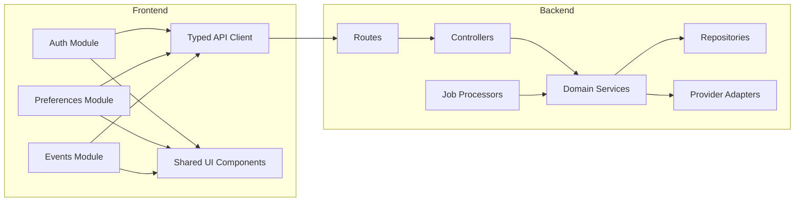

# Component Diagram (Frontend + Backend)

## Objective
Define major components inside application containers and their dependencies.

## Frontend Components
- Auth Module (session bootstrap, protected routing)
- Preferences Module (channel toggles)
- Events Module (event/reminder status visibility)
- API Client Layer (typed requests, retries, auth refresh)
- Shared UI Components (`packages/ui`)

## Backend Components
- Route Layer
- Controller Layer
- Service Layer
  - AuthService
  - IngestionService
  - ExtractionService
  - DedupeService
  - SchedulingService
  - DispatchService
  - CalendarSyncService
- Repository Layer
- Provider Adapter Layer (Google, WhatsApp, SMS)
- Job Processor Layer

## Key Dependencies
- Frontend API client depends on API contract definitions in `api-spec.md`
- Service layer depends on repositories and provider adapters
- Job processor depends on service methods designed as idempotent operations

## Component Diagram (Mermaid)

