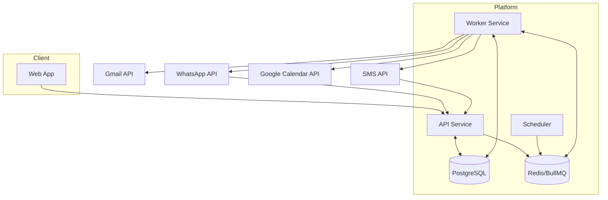

# Container Diagram (Runtime Services)

## Objective
Describe runtime containers/services and integration pathways.

## Containers
1. **Web App Container**
   - Next.js frontend
   - Handles UI routing, auth bootstrap, preference interactions
2. **API Container**
   - REST endpoints, auth/session handling, validation, orchestration
3. **Worker Container**
   - Queue consumers for ingestion, normalization, scheduling, dispatch, calendar sync
4. **Scheduler Container (logical role, can share worker runtime)**
   - Cron-triggered jobs for ingestion windows and due reminders
5. **PostgreSQL**
   - System-of-record data store
6. **Redis**
   - Queue broker, short-lived lock/idempotency state

## Interactions
- Web App -> API over HTTPS
- API <-> Postgres for transactional state
- API -> Redis queue for async jobs
- Worker <-> Redis queue for job consumption
- Worker <-> Postgres for domain persistence
- Worker <-> external providers for ingest/dispatch/sync
- Provider callbacks -> API webhook endpoints

## Container Diagram (Mermaid)

