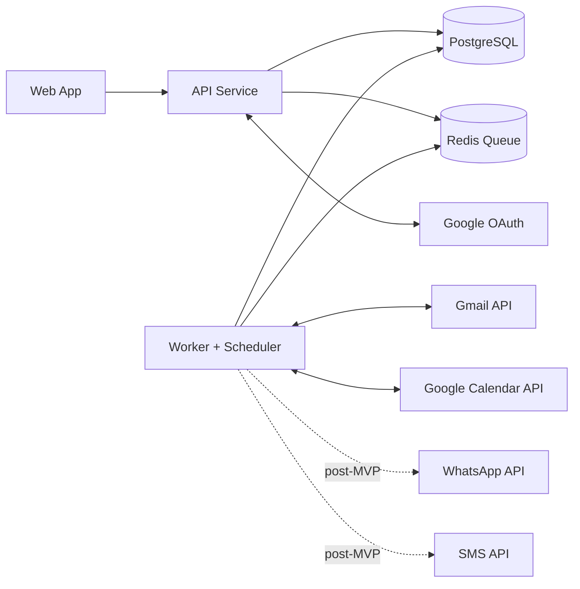

# Container Diagram (MVP-Aligned)

## Containers
1. Web App
2. API Service
3. Worker/Scheduler Service
4. PostgreSQL
5. Redis Queue

## External Dependencies
- Google OAuth
- Gmail API
- Google Calendar API
- Future-phase providers: WhatsApp/SMS (not in MVP runtime path)

## Responsibility Boundaries
- API: auth/session and orchestration entrypoints
- Worker: ingestion, extraction, dedupe, scheduling, calendar sync
- DB: source-of-truth records and sync status
- Redis: async orchestration and retries

## Critical MVP Flow
`gmail.ingest -> event.normalize/persist -> reminder.schedule -> calendar.sync`
