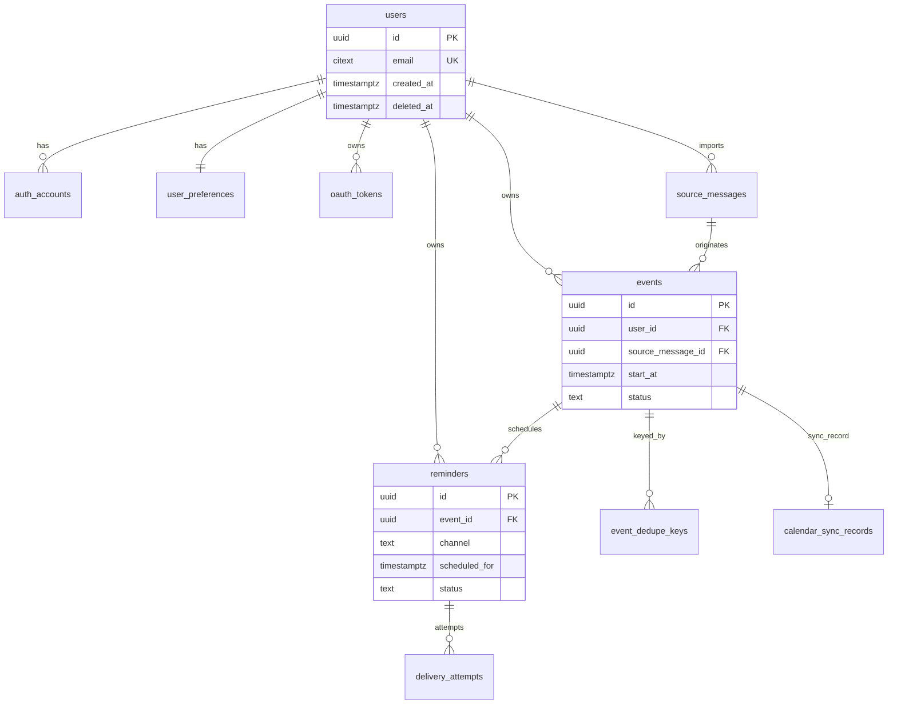

# Data Model Diagram

## Objective
Summarize core entities and relationships backing V1 workflows.

## Core Relationship Notes
- `users` own preferences, source messages, events, and reminders
- `source_messages` can produce one or more event candidates, dedupe links logical equivalence
- `events` generate `reminders`; reminders generate `delivery_attempts`
- Optional calendar sync state kept in `calendar_sync_records`
- `audit_logs` and `job_runs` provide operational traceability

## ER Diagram (Mermaid)

See detailed entity specification in `../db-schema.md`.
