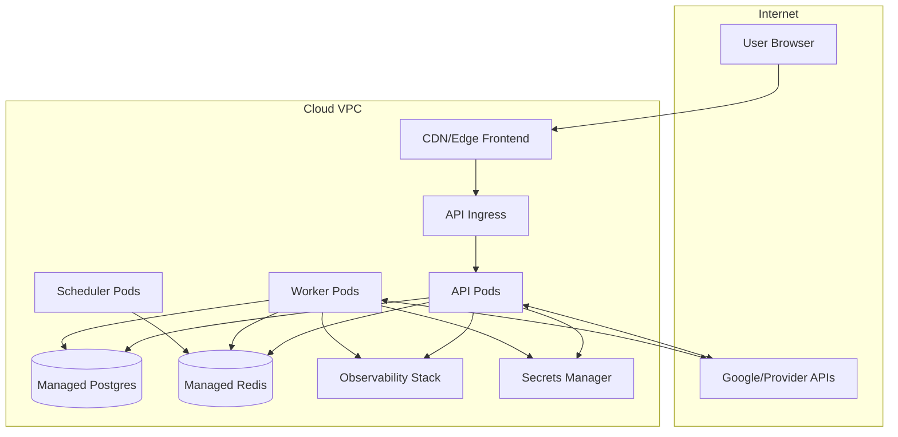

# Deployment Diagram

## Objective
Describe environment topology, infrastructure placement, and runtime relationships.

## Environments
- **Local:** developer machine + dockerized dependencies
- **Dev:** shared cloud namespace for integration testing
- **Staging:** production-like stack with controlled traffic
- **Production:** multi-AZ deployment with autoscaling and managed backups

## Hosting Model
- Frontend hosted on edge-capable platform/CDN
- API + Worker containers on managed Kubernetes or equivalent
- Managed Postgres and Redis in private network
- Secret manager for credentials and encryption keys
- Observability stack (metrics/logs/traces) centralized

## Runtime Placement
- Public ingress: frontend and API gateway
- Private subnet: workers, Postgres, Redis
- Egress controls for provider API traffic

## Deployment Diagram (Mermaid)

