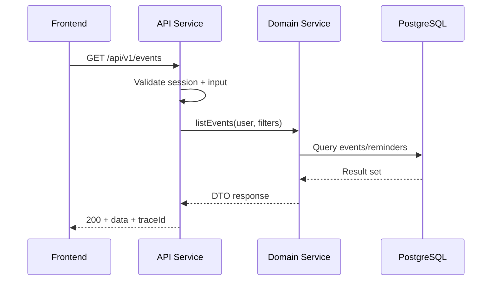
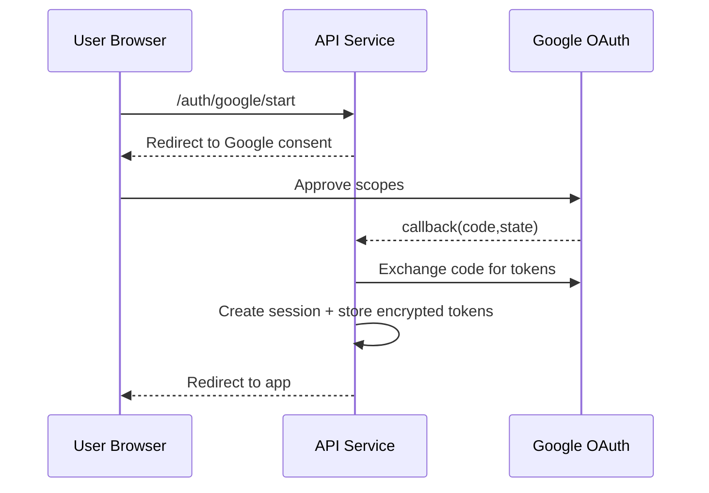
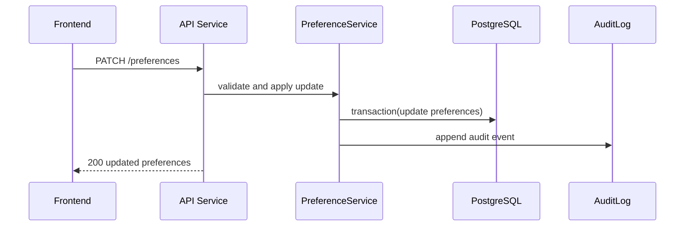
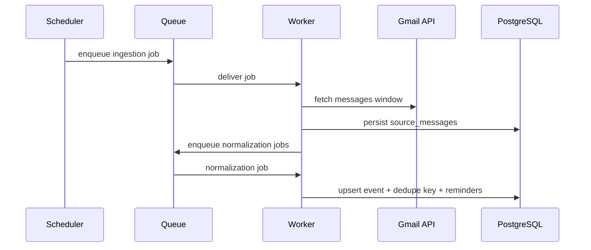
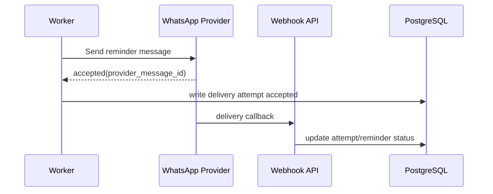

# Sequence Diagram Placeholders

These are baseline sequence outlines to be expanded as implementation details stabilize.

## 1) Request Handling (Authenticated API Call)

## 2) Auth Flow (Google OAuth)

## 3) Create/Update Flow (Preference Update)

## 4) Background Job Flow (Ingest -> Extract -> Schedule)

## 5) Integration Flow (Reminder Dispatch + Callback)

