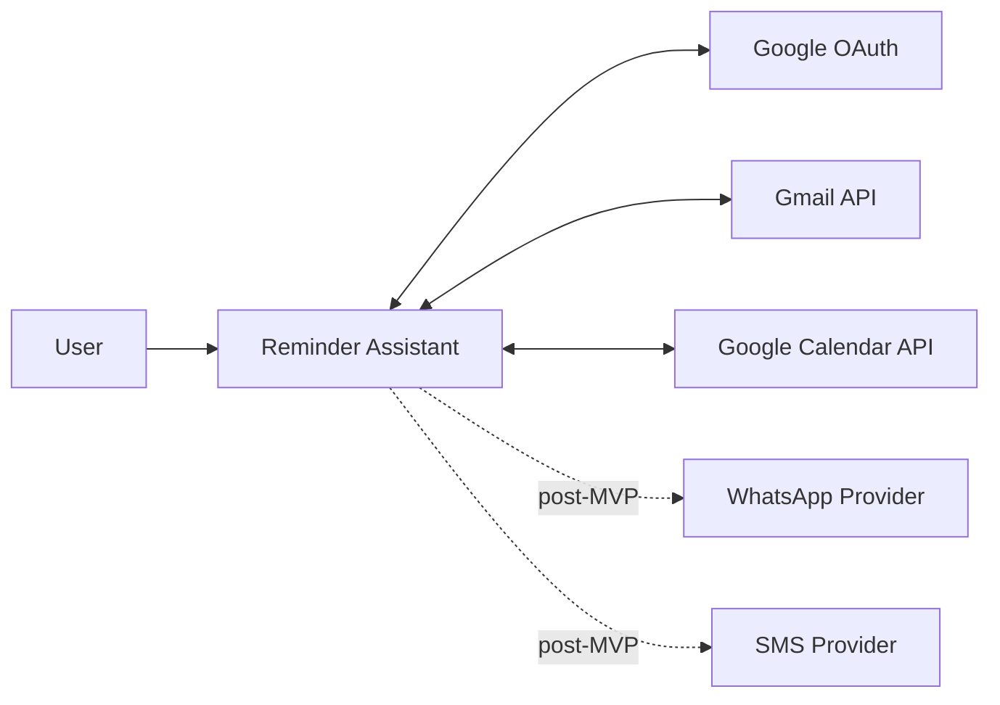

# System Context Diagram (MVP-Aligned)

## Actors and External Systems
- User
- Google OAuth
- Gmail API
- Google Calendar API (MVP)
- Future messaging providers (WhatsApp/SMS, post-MVP only)

## MVP Interaction Narrative
1. User authorizes Google access.
2. System ingests Gmail messages.
3. Event extraction and duplicate prevention execute.
4. Event is persisted and reminder schedule is generated.
5. Calendar sync job runs and upserts event to Google Calendar.
6. Sync result is logged using canonical states: `PENDING`, `IN_PROGRESS`, `SYNCED`, `FAILED_RETRYABLE`, `FAILED_TERMINAL`.

## Post-MVP Extension Note
WhatsApp and SMS channels are intentionally deferred and are shown only as future extensibility.

## Traceability
- FR-09 / US-09: Google Calendar sync in MVP.
- FR-07 / FR-08: WhatsApp/SMS post-MVP.
