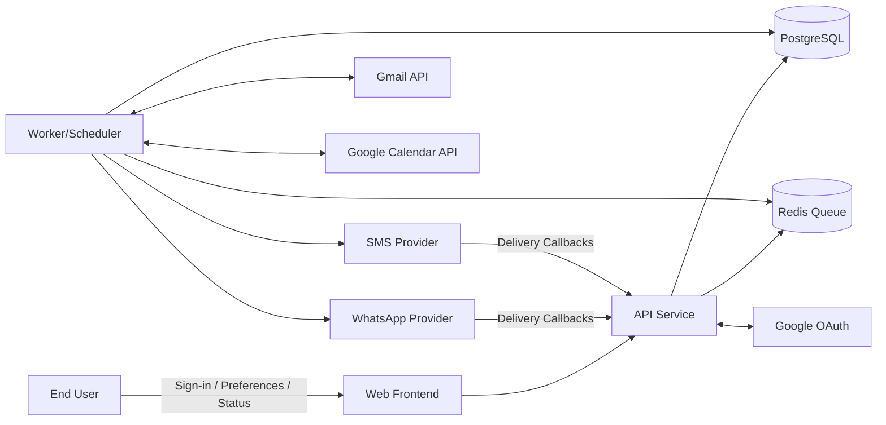

# System Context Diagram (Textual Specification)

## Objective
Define external actors/systems and high-level data flows around the Email-Driven Reminder Assistant.

## External Actors
- End User (mobile/web)
- Support/Operations user (internal tools - future)

## External Systems
- Google Identity (OAuth)
- Gmail API
- Google Calendar API (optional)
- WhatsApp Messaging Provider
- SMS Provider (optional)

## System Boundary
Inside boundary:
- Web frontend
- API backend
- Worker/scheduler pipeline
- Postgres + Redis

Outside boundary:
- All third-party providers and user devices

## Major Interactions
1. User authenticates via Google OAuth and grants scopes.
2. System ingests Gmail messages and extracts event candidates.
3. Extracted events are persisted and deduplicated.
4. Scheduler creates reminder tasks.
5. Dispatch jobs send notifications via WhatsApp/SMS providers.
6. Provider callbacks update final delivery states.
7. Optional calendar sync writes events to Google Calendar.

## Context Diagram (Mermaid)

