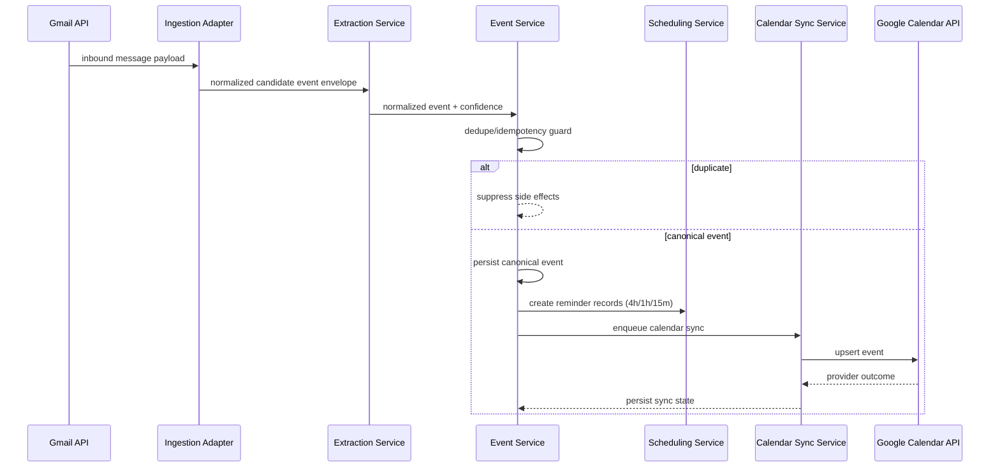

# MVP Runtime Flow (Canonical)

For critical documentation review, use `docs/05-prompts/critical-persona-review.md`.

## 1. Purpose
This document is the canonical definition of the MVP runtime lifecycle for the Email-Driven Reminder Assistant.

Canonical pipeline:
`ingest -> extract -> dedupe -> schedule -> calendar sync`

All other documentation sections must reference this file for lifecycle semantics instead of redefining the same sequence narrative.

## 2. Stage-by-Stage Lifecycle Responsibilities
1. **Ingestion (`ingest`)**
   - Source: Gmail API message metadata/body.
   - Owner: Ingestion Adapter.
   - Output: normalized candidate-event envelope with correlation IDs.
2. **Extraction (`extract`)**
   - Owner: Extraction Service.
   - Output: normalized event candidate with confidence metadata.
3. **Duplicate + Idempotency Guard (`dedupe`)**
   - Owner: Event Service.
   - Behavior: resolve deterministic dedupe/idempotency keys before side effects.
4. **Persistence + Reminder Scheduling (`schedule`)**
   - Owner: Event Service + Scheduling Service.
   - Behavior: persist canonical event first, then create 4h/1h/15m reminder records.
5. **Google Calendar Synchronization (`calendar sync`)**
   - Owner: Calendar Sync Service.
   - Behavior: enqueue and execute provider upsert only after successful persistence.

## 3. Canonical Sequence View

## 4. Runtime Boundaries and Controls
- Calendar sync is allowed only after canonical event persistence succeeds.
- Duplicate suppression must occur before schedule/sync fan-out.
- Correlation identifiers (`user_id`, `event_id`, `source_message_id`) propagate across all stages.
- Reliability semantics (retry policy, terminal failure handling, canonical sync states) are defined only in `reliability-policy.md`.

## 5. Cross References
- Reliability contract: `docs/01-tech-spec/reliability-policy.md`
- Runtime implementation details: `docs/01-tech-spec/backend-spec.md`
- Integration behavior and provider contracts: `docs/01-tech-spec/integration-spec.md`
- Architecture boundaries and ownership: `docs/03-design/architecture.md`
- Sequence viewpoints: `docs/03-design/sequence-flows.md`
