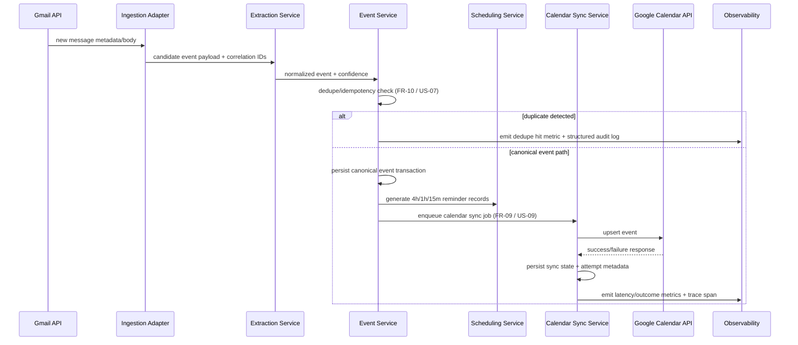
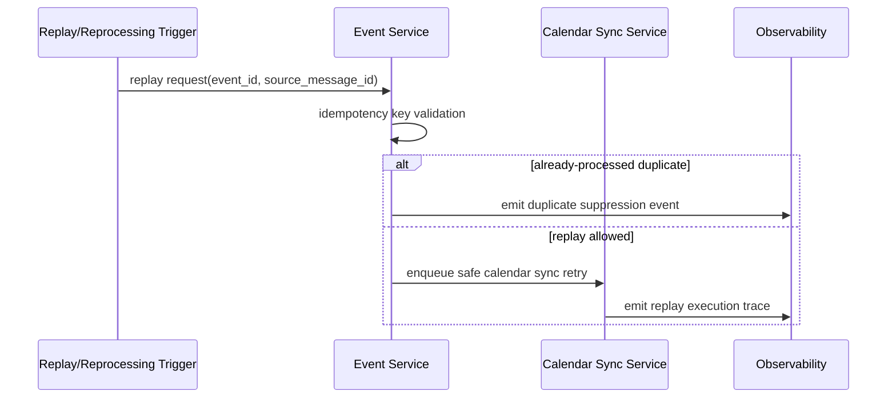

# MVP Sequence Flows

Canonical runtime lifecycle authority: `docs/02-design/runtime-flow.md`.

Canonical reliability policy authority: `docs/02-design/reliability-policy.md`.

## 1. Email to Calendar Sync (Primary MVP Flow)



**Trace reference:** see `docs/00-product/traceability-matrix.md`.

## 2. Calendar Sync Retry and Terminal Failure (Operational Reliability)

```mermaid
sequenceDiagram
  participant Sync as Calendar Sync Service
  participant Cal as Google Calendar API
  participant Obs as Observability
  participant Ops as Operator Workflow

  loop retry attempts (bounded max policy)
    Sync->>Cal: upsert event (timeout enforced)
    alt transient error / timeout
      Cal-->>Sync: retryable failure
      Sync->>Sync: persist attempt_count + last_error_code + next_retry_at
      Sync->>Obs: emit retry metric + structured reason log
    else success
      Cal-->>Sync: success
      Sync->>Sync: persist synchronized state
      Sync->>Obs: emit success metric + latency
      break sync complete
    end
  end

  alt retries exhausted or terminal error class
    Sync->>Sync: mark terminal_failed with failure metadata
    Sync->>Obs: emit terminal failure alert hook
    Obs->>Ops: create remediation signal (triage/replay)
  end
```

**Trace reference:** see `docs/00-product/traceability-matrix.md`.

## 3. Duplicate Prevention and Safe Reprocessing Boundary



**Trace reference:** see `docs/00-product/traceability-matrix.md`.

## 4. Scope Guardrails and Future-Phase Notes
- WhatsApp and SMS flows are intentionally excluded from MVP sequence runtime.
- Any references to these channels represent post-MVP extensibility only.
- MVP sequence authority remains Gmail → extraction → persistence/dedupe → scheduling → Google Calendar sync.

**Trace reference:** see `docs/00-product/traceability-matrix.md` and `docs/00-product/scope-v1.md`.
