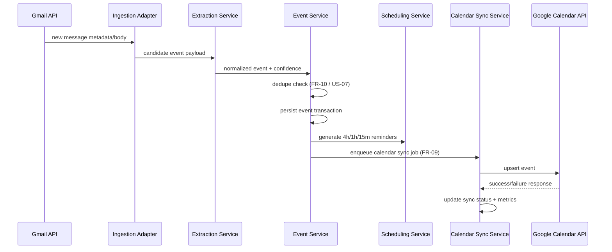
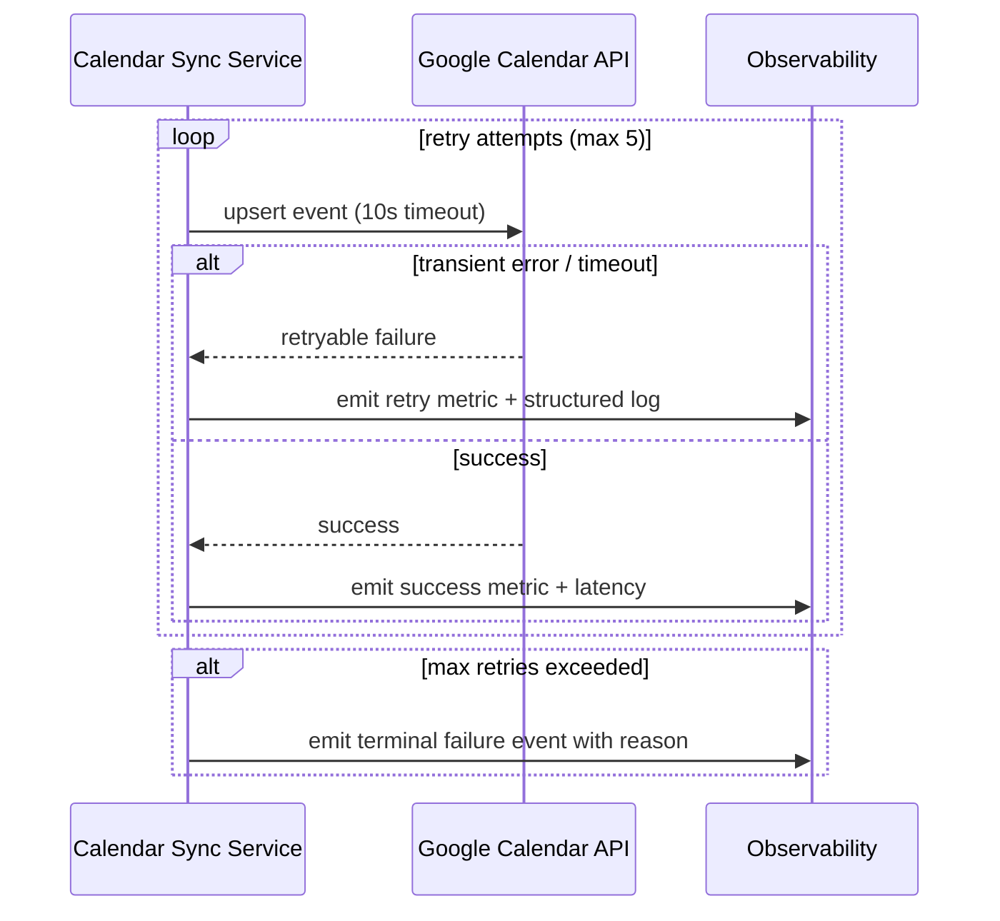

# MVP Sequence Flows

## 1. Email to Calendar Sync (Primary MVP Flow)

## 2. Calendar Sync Retry and Terminal Failure

## 3. Scope Guardrails
- WhatsApp and SMS flows are intentionally excluded from MVP sequence diagrams.
- These channels remain post-MVP extension points.
