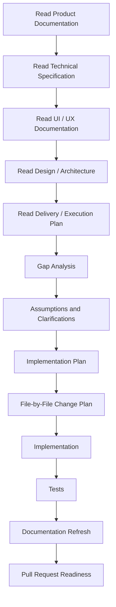
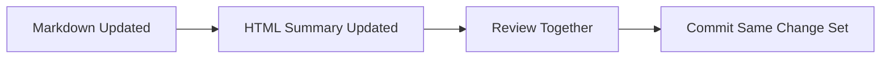
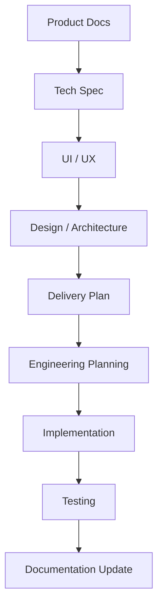
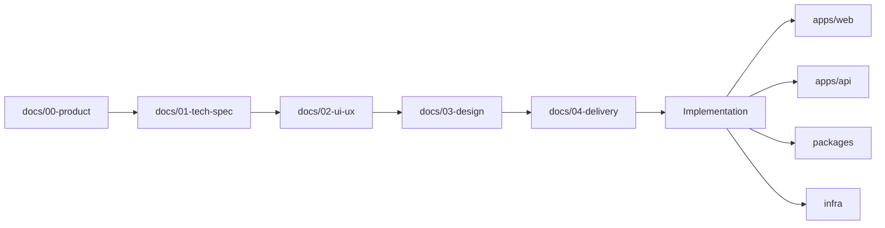
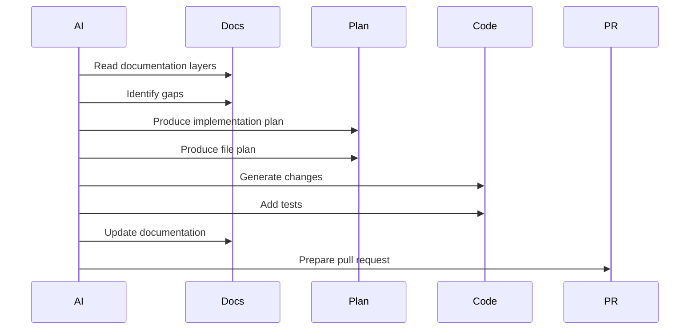

# AI Development Workflow

This repository follows a **documentation-first AI development process**.
All AI contributors, coding agents, and automation workflows must follow this document before producing design artifacts, implementation code, or repository changes.

This workflow ensures:
- traceability from business intent to implementation
- consistent documentation structure
- predictable AI outputs
- reviewable code changes
- alignment between stakeholders, designers, and engineers

---

# 1. Core Rule

AI contributors must **not jump directly to code**.

Before implementation begins, AI must:

1. Read the required documentation in order
2. Identify gaps, conflicts, and assumptions
3. Produce an implementation plan
4. Produce a file‑level change plan with traceability
5. Then generate code and tests
6. Update documentation in the same workflow

---

# 2. Workflow Overview



AI **must not generate implementation code until documentation is reviewed.**

---

# 3. Mandatory Documentation Reading Order

AI agents must read documentation in this order:

1. `docs/00-product`
2. `docs/01-tech-spec`
3. `docs/02-ui-ux`
4. `docs/03-design`
5. `docs/04-delivery`

This represents the progression:

**Business Intent → Technical Definition → UX → Architecture → Delivery**

---

# 4. Documentation Layer Responsibilities

| Layer | Path | Purpose |
|------|------|------|
| Product | docs/00-product | Vision, personas, requirements |
| Tech Spec | docs/01-tech-spec | System behavior, integrations |
| UI / UX | docs/02-ui-ux | User flows and interface behavior |
| Design | docs/03-design | Architecture diagrams and system structure |
| Delivery | docs/04-delivery | Implementation and rollout planning |
| Prompt Library | docs/05-prompts | Canonical prompts for AI workflows |

---

# 5. Canonical Prompt Library

Canonical prompts are stored in:

```
docs/05-prompts
```

Rules:
- Prefer existing prompts.
- Do not invent prompts if one exists.
- New prompts must be added to the prompt library.

---

# 6. Dual‑Layer Documentation Rule

Each documentation area must have:

### Markdown
Detailed working documentation (source of truth)

### HTML Summary
Stakeholder presentation layer

Required summaries:

```
docs/00-product/product-summary.html
docs/01-tech-spec/tech-spec-summary.html
docs/02-ui-ux/ui-ux-summary.html
docs/03-design/design-summary.html
docs/04-delivery/delivery-summary.html
```

Markdown changes must update HTML summaries in the **same commit**.

---

# 7. Documentation Synchronization Workflow



Markdown and HTML documentation **must remain synchronized**.

---

# 8. Required Process Before Code

1. Review documentation
2. Produce gap analysis
3. List assumptions
4. Request clarification if needed
5. Produce phased implementation plan
6. Produce file‑by‑file change plan
7. Implement
8. Add tests
9. Refresh documentation

---

# 9. Development Flow



---

# 10. Repository Scope and Location Rules

Frontend:

```
apps/web
```

Backend:

```
apps/api
```

Shared Code:

```
packages/
```

Infrastructure:

```
infra/
```

---

# 11. Architecture Constraints

Backend architecture:

```
routes → controllers → services → repositories → models
```

Frontend structure:

Feature‑based modules:

```
apps/web/src/features/
```

Shared UI:

```
packages/ui
```

---

# 12. Visual Architecture Navigation Map



---

# 13. Documentation Maturity Checklist

| Level | Meaning |
|------|------|
| 0 | Missing |
| 1 | Incomplete |
| 2 | Mostly defined |
| 3 | Ready for implementation |
| 4 | Complete and synchronized |

Checklist examples:

Product docs:
- Vision defined
- Personas defined
- Requirements documented
- Acceptance criteria defined

Tech spec:
- Data model defined
- Integrations defined
- Security documented

UI/UX:
- User flows documented
- Screen inventory defined

Design:
- Architecture diagrams exist
- Data flows defined

Delivery:
- Implementation phases defined

---

# 14. Traceability Matrix

Implementation must map to documentation.

| Change | Product Source | Tech Source | UI Source | Design Source |
|------|------|------|------|------|
| Example feature | requirements.md | tech-spec | ui-flow | architecture |

AI must avoid implementing behavior not traceable to documentation.

---

# 15. File‑by‑File Planning

Before coding, AI must produce a plan:

| File | Action | Purpose |
|------|------|------|
| apps/api/events.ts | create | event endpoint |
| apps/web/events.tsx | update | event UI |

---

# 16. Quality Rules

AI generated code must:

- include tests for core flows
- map to documented requirements
- avoid invented functionality

If documentation conflicts exist:

1. report the gap
2. list assumptions
3. request clarification

---

# 17. Pull Request Checklist for AI Agents

Before PR submission:

Documentation
- [ ] Docs read in correct order
- [ ] Documentation updated if behavior changed
- [ ] HTML summaries updated

Design
- [ ] Architecture respected
- [ ] File plan followed

Implementation
- [ ] No undocumented behavior
- [ ] Correct repository structure used

Testing
- [ ] Core flows tested

---

# 18. AI Decision Rules

1. Prefer documentation over guessing
2. Prefer clarification over assumptions
3. Prefer small reviewable changes
4. Maintain traceability
5. Follow repository conventions

---

# 19. AI Output Expectations

Typical AI output sequence:

1. documentation review summary
2. gap analysis
3. assumptions
4. implementation plan
5. file‑level plan
6. code changes
7. tests
8. documentation updates

---

# 20. Example AI Working Sequence



---

# 21. Completion Rule

A task is complete only when:

- implementation is traceable
- tests exist
- documentation updated
- HTML summaries synchronized
- repository conventions respected

---

# 22. Core Principles

This repository follows:

- Documentation First
- Design Before Code
- Traceable Requirements
- Consistent Architecture
- Reviewable Changes

Documentation is the **primary contract for implementation**.

---

# 23. Quick Reference

Read first:

1. docs/00-product
2. docs/01-tech-spec
3. docs/02-ui-ux
4. docs/03-design
5. docs/04-delivery

Use prompts from:

```
docs/05-prompts
```

Code locations:

- frontend → apps/web
- backend → apps/api
- shared → packages/
- infra → infra/
